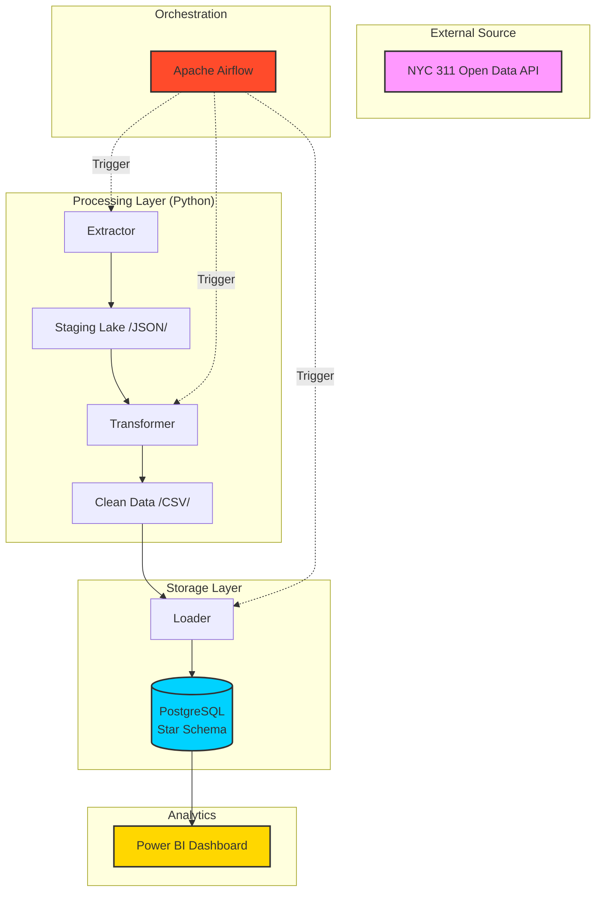

# 🏙️ NYC 311 Automated ETL Pipeline

## 📋 Overview

This project is a **production-grade ETL (Extract, Transform, Load) pipeline** designed to ingest, process, and analyze NYC 311 service request data. By leveraging a modern data engineering stack, this project transforms raw API data into a high-performance **Star Schema Data Warehouse** hosted on PostgreSQL, orchestrated by Apache Airflow.

The final architecture is optimized for **Business Intelligence (BI)**, providing a clean, reliable data source for interactive Power BI dashboards.

---

## 🏗️ Architecture



---

## 🚀 Tech Stack

| Category | Technology |
| :--- | :--- |
| **Language** |  |
| **Orchestration** |  |
| **Data Warehouse** |  |
| **Data Processing** |  |
| **Containerization**|  |
| **Visualization** |  |

---

## 🗄️ Data Warehouse Design

The project implements a **Star Schema** to ensure query efficiency and analytical flexibility.

### Fact Table
- `fact_complaints`: Contains grain-level service requests with foreign keys to all dimensions and calculated metrics (e.g., `resolution_time_hours`).

### Dimensions
- `dim_date`: Comprehensive time intelligence (Year, Quarter, Month, Weekday).
- `dim_location`: Geographic hierarchy (Borough, City, Zip Code).
- `dim_agency`: Agency details and classification.

---

## 🛠️ Setup & Installation

### 1. Prerequisites
- **Docker Desktop** (Required for Airflow and PostgreSQL)
- **Python 3.9+**
- **Power BI Desktop** (Optional, for dashboarding)

### 2. Environment Configuration
```bash
# Clone the repository
git clone https://github.com/yourusername/automated-etl-pipelines.git
cd nyc311-etl-pipeline

# Create virtual environment
python -m venv venv
source venv/bin/activate  # On Windows: .\venv\Scripts\activate

# Install dependencies
pip install -r requirements.txt

# Setup environment variables
cp .env.example .env  # On Windows: copy .env.example .env
```

### 3. Spin up Infrastructure
```bash
docker-compose up -d
```
This will launch:
- **PostgreSQL**: Accessible at `localhost:5433`
- **Airflow Webserver**: Accessible at `localhost:8080` (Default: `admin`/`admin123`)

---

## ⚡ Execution

### Automated Orchestration
The pipeline is scheduled to run daily at **6:00 AM UTC**. You can monitor progress and logs via the Airflow UI.

### Manual Trigger
For ad-hoc runs or testing:
```bash
python extract_nyc311.py     # Pull data from Socrata API
python transform_nyc311.py   # Data cleaning & validation
python load_nyc311.py        # Upsert into PostgreSQL
python test_pipeline.py      # Run data quality checks
```

---

## 📊 Analytics & Reporting
Connect Power BI to the PostgreSQL instance:
- **Host**: `127.0.0.1`
- **Port**: `5433`
- **Database**: `nyc311_warehouse`

---

## 🛡️ Best Practices
- **Idempotency**: All pipelines are designed to be rerun without duplicating data.
- **Observability**: Logging and Airflow metadata are used to monitor pipeline health.
- **Scalability**: Star schema design allows for efficient analytical queries on large datasets.

---

## 📜 License
Distributed under the MIT License. See `LICENSE` for more information.


